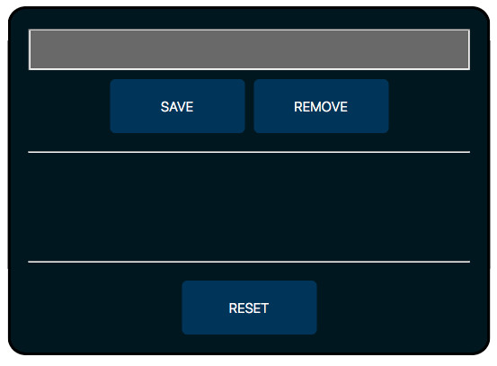

# Numbery & NaNy

> Starter Code exercises to practice javascript coding and learn how to build and use a data model to save the state of the webpages, complete exercise with listeners, handlers, data, init load and logging.

## Table of contents
* [General info](#general-info)
* [Screenshots](#screenshots)
* [Technologies](#technologies)
* [Setup](#setup)
* [Features](#features)
* [Status](#status)
* [Inspiration](#inspiration)
* [Contact](#contact)

## General info
The purpose of the project is to continue learning and using javascript on webpages, use data structures of the javascript language to save the state of webpages.

## Screenshots

## Technologies
* HTML5
* CSS3
* git
* javascript

## Setup
You can clone or fork this repository and test the files.

## Features
The project features a web site with:
* Input box to allow the user save or remove it's content from the entries data state.
* Save button to store input text into data object 'entries' with numbery array for all number type and nany array for the string type, it must not allow to store duplicate values.
* Remove button to remove an entry for the list, after removing it must allow to store the value again.
* Reset button to clear data object and restore init values.

## Status
Project is: finished, final version.

## Inspiration
[this repository](https://github.com/HackYourFutureBelgium/numbery-and-nany)

## Contact
Created by [@ferrycosv](www.github.com/ferrycosv) - feel free to contact me!